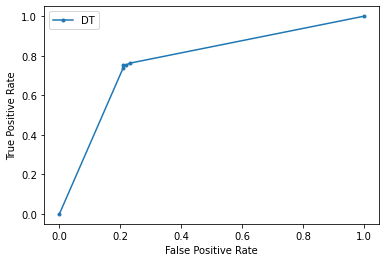
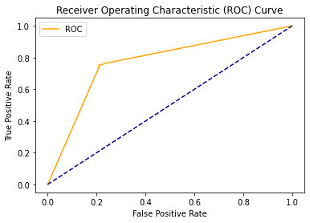

### Assignment 2: Classification in Python

In this assignment, we use classification methods to predict survival on the Titanic and learn about features that contributed to the survival of each passenger. The data and data description is available in https://www.kaggle.com/c/titanic/overview.

Please read the train data file and follow the instructions and answer the questions.

1- Read train.csv using Pandas. Call this dataframe df.


```python
import pandas as pd
import numpy as np
```


```python
df = pd.read_csv("/home/jupyter/assignment1/train.csv",
                    skipinitialspace=True, 
                na_values = ["?","","."," ","NA","na","NaN","nan"])

df.head(2)
```


<div>
<style scoped>
    .dataframe tbody tr th:only-of-type {
        vertical-align: middle;
    }

    .dataframe tbody tr th {
        vertical-align: top;
    }

    .dataframe thead th {
        text-align: right;
    }
</style>
<table border="1" class="dataframe">
  <thead>
    <tr style="text-align: right;">
      <th></th>
      <th>PassengerId</th>
      <th>Survived</th>
      <th>Pclass</th>
      <th>Name</th>
      <th>Sex</th>
      <th>Age</th>
      <th>SibSp</th>
      <th>Parch</th>
      <th>Ticket</th>
      <th>Fare</th>
      <th>Cabin</th>
      <th>Embarked</th>
    </tr>
  </thead>
  <tbody>
    <tr>
      <th>0</th>
      <td>1</td>
      <td>0</td>
      <td>3</td>
      <td>Braund, Mr. Owen Harris</td>
      <td>male</td>
      <td>22.0</td>
      <td>1</td>
      <td>0</td>
      <td>A/5 21171</td>
      <td>7.2500</td>
      <td>NaN</td>
      <td>S</td>
    </tr>
    <tr>
      <th>1</th>
      <td>2</td>
      <td>1</td>
      <td>1</td>
      <td>Cumings, Mrs. John Bradley (Florence Briggs Th...</td>
      <td>female</td>
      <td>38.0</td>
      <td>1</td>
      <td>0</td>
      <td>PC 17599</td>
      <td>71.2833</td>
      <td>C85</td>
      <td>C</td>
    </tr>
  </tbody>
</table>
</div>


2- Is there any missing values in df? If so, which column has the highest number of missing values?


```python
df.info()
```

    <class 'pandas.core.frame.DataFrame'>
    RangeIndex: 891 entries, 0 to 890
    Data columns (total 12 columns):
     #   Column       Non-Null Count  Dtype  
    ---  ------       --------------  -----  
     0   PassengerId  891 non-null    int64  
     1   Survived     891 non-null    int64  
     2   Pclass       891 non-null    int64  
     3   Name         891 non-null    object 
     4   Sex          891 non-null    object 
     5   Age          714 non-null    float64
     6   SibSp        891 non-null    int64  
     7   Parch        891 non-null    int64  
     8   Ticket       891 non-null    object 
     9   Fare         891 non-null    float64
     10  Cabin        204 non-null    object 
     11  Embarked     889 non-null    object 
    dtypes: float64(2), int64(5), object(5)
    memory usage: 83.7+ KB


3- Create a histogram of column Age.


```python
import plotly.express as px
fig = px.histogram(df, x = "Age")
fig.show()
```


<div>


            <div id="9e6154d6-f4a9-4183-ad6c-009d37ac8476" class="plotly-graph-div" style="height:525px; width:100%;"></div>
            <script type="text/javascript">
                require(["plotly"], function(Plotly) {
                    window.PLOTLYENV=window.PLOTLYENV || {};

                if (document.getElementById("9e6154d6-f4a9-4183-ad6c-009d37ac8476")) {
                    Plotly.newPlot(
                        '9e6154d6-f4a9-4183-ad6c-009d37ac8476',
                        [{"alignmentgroup": "True", "bingroup": "x", "hovertemplate": "Age=%{x}<br>count=%{y}<extra></extra>", "legendgroup": "", "marker": {"color": "#636efa"}, "name": "", "offsetgroup": "", "orientation": "v", "showlegend": false, "type": "histogram", "x": [22.0, 38.0, 26.0, 35.0, 35.0, null, 54.0, 2.0, 27.0, 14.0, 4.0, 58.0, 20.0, 39.0, 14.0, 55.0, 2.0, null, 31.0, null, 35.0, 34.0, 15.0, 28.0, 8.0, 38.0, null, 19.0, null, null, 40.0, null, null, 66.0, 28.0, 42.0, null, 21.0, 18.0, 14.0, 40.0, 27.0, null, 3.0, 19.0, null, null, null, null, 18.0, 7.0, 21.0, 49.0, 29.0, 65.0, null, 21.0, 28.5, 5.0, 11.0, 22.0, 38.0, 45.0, 4.0, null, null, 29.0, 19.0, 17.0, 26.0, 32.0, 16.0, 21.0, 26.0, 32.0, 25.0, null, null, 0.83, 30.0, 22.0, 29.0, null, 28.0, 17.0, 33.0, 16.0, null, 23.0, 24.0, 29.0, 20.0, 46.0, 26.0, 59.0, null, 71.0, 23.0, 34.0, 34.0, 28.0, null, 21.0, 33.0, 37.0, 28.0, 21.0, null, 38.0, null, 47.0, 14.5, 22.0, 20.0, 17.0, 21.0, 70.5, 29.0, 24.0, 2.0, 21.0, null, 32.5, 32.5, 54.0, 12.0, null, 24.0, null, 45.0, 33.0, 20.0, 47.0, 29.0, 25.0, 23.0, 19.0, 37.0, 16.0, 24.0, null, 22.0, 24.0, 19.0, 18.0, 19.0, 27.0, 9.0, 36.5, 42.0, 51.0, 22.0, 55.5, 40.5, null, 51.0, 16.0, 30.0, null, null, 44.0, 40.0, 26.0, 17.0, 1.0, 9.0, null, 45.0, null, 28.0, 61.0, 4.0, 1.0, 21.0, 56.0, 18.0, null, 50.0, 30.0, 36.0, null, null, 9.0, 1.0, 4.0, null, null, 45.0, 40.0, 36.0, 32.0, 19.0, 19.0, 3.0, 44.0, 58.0, null, 42.0, null, 24.0, 28.0, null, 34.0, 45.5, 18.0, 2.0, 32.0, 26.0, 16.0, 40.0, 24.0, 35.0, 22.0, 30.0, null, 31.0, 27.0, 42.0, 32.0, 30.0, 16.0, 27.0, 51.0, null, 38.0, 22.0, 19.0, 20.5, 18.0, null, 35.0, 29.0, 59.0, 5.0, 24.0, null, 44.0, 8.0, 19.0, 33.0, null, null, 29.0, 22.0, 30.0, 44.0, 25.0, 24.0, 37.0, 54.0, null, 29.0, 62.0, 30.0, 41.0, 29.0, null, 30.0, 35.0, 50.0, null, 3.0, 52.0, 40.0, null, 36.0, 16.0, 25.0, 58.0, 35.0, null, 25.0, 41.0, 37.0, null, 63.0, 45.0, null, 7.0, 35.0, 65.0, 28.0, 16.0, 19.0, null, 33.0, 30.0, 22.0, 42.0, 22.0, 26.0, 19.0, 36.0, 24.0, 24.0, null, 23.5, 2.0, null, 50.0, null, null, 19.0, null, null, 0.92, null, 17.0, 30.0, 30.0, 24.0, 18.0, 26.0, 28.0, 43.0, 26.0, 24.0, 54.0, 31.0, 40.0, 22.0, 27.0, 30.0, 22.0, null, 36.0, 61.0, 36.0, 31.0, 16.0, null, 45.5, 38.0, 16.0, null, null, 29.0, 41.0, 45.0, 45.0, 2.0, 24.0, 28.0, 25.0, 36.0, 24.0, 40.0, null, 3.0, 42.0, 23.0, null, 15.0, 25.0, null, 28.0, 22.0, 38.0, null, null, 40.0, 29.0, 45.0, 35.0, null, 30.0, 60.0, null, null, 24.0, 25.0, 18.0, 19.0, 22.0, 3.0, null, 22.0, 27.0, 20.0, 19.0, 42.0, 1.0, 32.0, 35.0, null, 18.0, 1.0, 36.0, null, 17.0, 36.0, 21.0, 28.0, 23.0, 24.0, 22.0, 31.0, 46.0, 23.0, 28.0, 39.0, 26.0, 21.0, 28.0, 20.0, 34.0, 51.0, 3.0, 21.0, null, null, null, 33.0, null, 44.0, null, 34.0, 18.0, 30.0, 10.0, null, 21.0, 29.0, 28.0, 18.0, null, 28.0, 19.0, null, 32.0, 28.0, null, 42.0, 17.0, 50.0, 14.0, 21.0, 24.0, 64.0, 31.0, 45.0, 20.0, 25.0, 28.0, null, 4.0, 13.0, 34.0, 5.0, 52.0, 36.0, null, 30.0, 49.0, null, 29.0, 65.0, null, 50.0, null, 48.0, 34.0, 47.0, 48.0, null, 38.0, null, 56.0, null, 0.75, null, 38.0, 33.0, 23.0, 22.0, null, 34.0, 29.0, 22.0, 2.0, 9.0, null, 50.0, 63.0, 25.0, null, 35.0, 58.0, 30.0, 9.0, null, 21.0, 55.0, 71.0, 21.0, null, 54.0, null, 25.0, 24.0, 17.0, 21.0, null, 37.0, 16.0, 18.0, 33.0, null, 28.0, 26.0, 29.0, null, 36.0, 54.0, 24.0, 47.0, 34.0, null, 36.0, 32.0, 30.0, 22.0, null, 44.0, null, 40.5, 50.0, null, 39.0, 23.0, 2.0, null, 17.0, null, 30.0, 7.0, 45.0, 30.0, null, 22.0, 36.0, 9.0, 11.0, 32.0, 50.0, 64.0, 19.0, null, 33.0, 8.0, 17.0, 27.0, null, 22.0, 22.0, 62.0, 48.0, null, 39.0, 36.0, null, 40.0, 28.0, null, null, 24.0, 19.0, 29.0, null, 32.0, 62.0, 53.0, 36.0, null, 16.0, 19.0, 34.0, 39.0, null, 32.0, 25.0, 39.0, 54.0, 36.0, null, 18.0, 47.0, 60.0, 22.0, null, 35.0, 52.0, 47.0, null, 37.0, 36.0, null, 49.0, null, 49.0, 24.0, null, null, 44.0, 35.0, 36.0, 30.0, 27.0, 22.0, 40.0, 39.0, null, null, null, 35.0, 24.0, 34.0, 26.0, 4.0, 26.0, 27.0, 42.0, 20.0, 21.0, 21.0, 61.0, 57.0, 21.0, 26.0, null, 80.0, 51.0, 32.0, null, 9.0, 28.0, 32.0, 31.0, 41.0, null, 20.0, 24.0, 2.0, null, 0.75, 48.0, 19.0, 56.0, null, 23.0, null, 18.0, 21.0, null, 18.0, 24.0, null, 32.0, 23.0, 58.0, 50.0, 40.0, 47.0, 36.0, 20.0, 32.0, 25.0, null, 43.0, null, 40.0, 31.0, 70.0, 31.0, null, 18.0, 24.5, 18.0, 43.0, 36.0, null, 27.0, 20.0, 14.0, 60.0, 25.0, 14.0, 19.0, 18.0, 15.0, 31.0, 4.0, null, 25.0, 60.0, 52.0, 44.0, null, 49.0, 42.0, 18.0, 35.0, 18.0, 25.0, 26.0, 39.0, 45.0, 42.0, 22.0, null, 24.0, null, 48.0, 29.0, 52.0, 19.0, 38.0, 27.0, null, 33.0, 6.0, 17.0, 34.0, 50.0, 27.0, 20.0, 30.0, null, 25.0, 25.0, 29.0, 11.0, null, 23.0, 23.0, 28.5, 48.0, 35.0, null, null, null, 36.0, 21.0, 24.0, 31.0, 70.0, 16.0, 30.0, 19.0, 31.0, 4.0, 6.0, 33.0, 23.0, 48.0, 0.67, 28.0, 18.0, 34.0, 33.0, null, 41.0, 20.0, 36.0, 16.0, 51.0, null, 30.5, null, 32.0, 24.0, 48.0, 57.0, null, 54.0, 18.0, null, 5.0, null, 43.0, 13.0, 17.0, 29.0, null, 25.0, 25.0, 18.0, 8.0, 1.0, 46.0, null, 16.0, null, null, 25.0, 39.0, 49.0, 31.0, 30.0, 30.0, 34.0, 31.0, 11.0, 0.42, 27.0, 31.0, 39.0, 18.0, 39.0, 33.0, 26.0, 39.0, 35.0, 6.0, 30.5, null, 23.0, 31.0, 43.0, 10.0, 52.0, 27.0, 38.0, 27.0, 2.0, null, null, 1.0, null, 62.0, 15.0, 0.83, null, 23.0, 18.0, 39.0, 21.0, null, 32.0, null, 20.0, 16.0, 30.0, 34.5, 17.0, 42.0, null, 35.0, 28.0, null, 4.0, 74.0, 9.0, 16.0, 44.0, 18.0, 45.0, 51.0, 24.0, null, 41.0, 21.0, 48.0, null, 24.0, 42.0, 27.0, 31.0, null, 4.0, 26.0, 47.0, 33.0, 47.0, 28.0, 15.0, 20.0, 19.0, null, 56.0, 25.0, 33.0, 22.0, 28.0, 25.0, 39.0, 27.0, 19.0, null, 26.0, 32.0], "xaxis": "x", "yaxis": "y"}],
                        {"barmode": "relative", "legend": {"tracegroupgap": 0}, "margin": {"t": 60}, "template": {"data": {"bar": [{"error_x": {"color": "#2a3f5f"}, "error_y": {"color": "#2a3f5f"}, "marker": {"line": {"color": "#E5ECF6", "width": 0.5}}, "type": "bar"}], "barpolar": [{"marker": {"line": {"color": "#E5ECF6", "width": 0.5}}, "type": "barpolar"}], "carpet": [{"aaxis": {"endlinecolor": "#2a3f5f", "gridcolor": "white", "linecolor": "white", "minorgridcolor": "white", "startlinecolor": "#2a3f5f"}, "baxis": {"endlinecolor": "#2a3f5f", "gridcolor": "white", "linecolor": "white", "minorgridcolor": "white", "startlinecolor": "#2a3f5f"}, "type": "carpet"}], "choropleth": [{"colorbar": {"outlinewidth": 0, "ticks": ""}, "type": "choropleth"}], "contour": [{"colorbar": {"outlinewidth": 0, "ticks": ""}, "colorscale": [[0.0, "#0d0887"], [0.1111111111111111, "#46039f"], [0.2222222222222222, "#7201a8"], [0.3333333333333333, "#9c179e"], [0.4444444444444444, "#bd3786"], [0.5555555555555556, "#d8576b"], [0.6666666666666666, "#ed7953"], [0.7777777777777778, "#fb9f3a"], [0.8888888888888888, "#fdca26"], [1.0, "#f0f921"]], "type": "contour"}], "contourcarpet": [{"colorbar": {"outlinewidth": 0, "ticks": ""}, "type": "contourcarpet"}], "heatmap": [{"colorbar": {"outlinewidth": 0, "ticks": ""}, "colorscale": [[0.0, "#0d0887"], [0.1111111111111111, "#46039f"], [0.2222222222222222, "#7201a8"], [0.3333333333333333, "#9c179e"], [0.4444444444444444, "#bd3786"], [0.5555555555555556, "#d8576b"], [0.6666666666666666, "#ed7953"], [0.7777777777777778, "#fb9f3a"], [0.8888888888888888, "#fdca26"], [1.0, "#f0f921"]], "type": "heatmap"}], "heatmapgl": [{"colorbar": {"outlinewidth": 0, "ticks": ""}, "colorscale": [[0.0, "#0d0887"], [0.1111111111111111, "#46039f"], [0.2222222222222222, "#7201a8"], [0.3333333333333333, "#9c179e"], [0.4444444444444444, "#bd3786"], [0.5555555555555556, "#d8576b"], [0.6666666666666666, "#ed7953"], [0.7777777777777778, "#fb9f3a"], [0.8888888888888888, "#fdca26"], [1.0, "#f0f921"]], "type": "heatmapgl"}], "histogram": [{"marker": {"colorbar": {"outlinewidth": 0, "ticks": ""}}, "type": "histogram"}], "histogram2d": [{"colorbar": {"outlinewidth": 0, "ticks": ""}, "colorscale": [[0.0, "#0d0887"], [0.1111111111111111, "#46039f"], [0.2222222222222222, "#7201a8"], [0.3333333333333333, "#9c179e"], [0.4444444444444444, "#bd3786"], [0.5555555555555556, "#d8576b"], [0.6666666666666666, "#ed7953"], [0.7777777777777778, "#fb9f3a"], [0.8888888888888888, "#fdca26"], [1.0, "#f0f921"]], "type": "histogram2d"}], "histogram2dcontour": [{"colorbar": {"outlinewidth": 0, "ticks": ""}, "colorscale": [[0.0, "#0d0887"], [0.1111111111111111, "#46039f"], [0.2222222222222222, "#7201a8"], [0.3333333333333333, "#9c179e"], [0.4444444444444444, "#bd3786"], [0.5555555555555556, "#d8576b"], [0.6666666666666666, "#ed7953"], [0.7777777777777778, "#fb9f3a"], [0.8888888888888888, "#fdca26"], [1.0, "#f0f921"]], "type": "histogram2dcontour"}], "mesh3d": [{"colorbar": {"outlinewidth": 0, "ticks": ""}, "type": "mesh3d"}], "parcoords": [{"line": {"colorbar": {"outlinewidth": 0, "ticks": ""}}, "type": "parcoords"}], "pie": [{"automargin": true, "type": "pie"}], "scatter": [{"marker": {"colorbar": {"outlinewidth": 0, "ticks": ""}}, "type": "scatter"}], "scatter3d": [{"line": {"colorbar": {"outlinewidth": 0, "ticks": ""}}, "marker": {"colorbar": {"outlinewidth": 0, "ticks": ""}}, "type": "scatter3d"}], "scattercarpet": [{"marker": {"colorbar": {"outlinewidth": 0, "ticks": ""}}, "type": "scattercarpet"}], "scattergeo": [{"marker": {"colorbar": {"outlinewidth": 0, "ticks": ""}}, "type": "scattergeo"}], "scattergl": [{"marker": {"colorbar": {"outlinewidth": 0, "ticks": ""}}, "type": "scattergl"}], "scattermapbox": [{"marker": {"colorbar": {"outlinewidth": 0, "ticks": ""}}, "type": "scattermapbox"}], "scatterpolar": [{"marker": {"colorbar": {"outlinewidth": 0, "ticks": ""}}, "type": "scatterpolar"}], "scatterpolargl": [{"marker": {"colorbar": {"outlinewidth": 0, "ticks": ""}}, "type": "scatterpolargl"}], "scatterternary": [{"marker": {"colorbar": {"outlinewidth": 0, "ticks": ""}}, "type": "scatterternary"}], "surface": [{"colorbar": {"outlinewidth": 0, "ticks": ""}, "colorscale": [[0.0, "#0d0887"], [0.1111111111111111, "#46039f"], [0.2222222222222222, "#7201a8"], [0.3333333333333333, "#9c179e"], [0.4444444444444444, "#bd3786"], [0.5555555555555556, "#d8576b"], [0.6666666666666666, "#ed7953"], [0.7777777777777778, "#fb9f3a"], [0.8888888888888888, "#fdca26"], [1.0, "#f0f921"]], "type": "surface"}], "table": [{"cells": {"fill": {"color": "#EBF0F8"}, "line": {"color": "white"}}, "header": {"fill": {"color": "#C8D4E3"}, "line": {"color": "white"}}, "type": "table"}]}, "layout": {"annotationdefaults": {"arrowcolor": "#2a3f5f", "arrowhead": 0, "arrowwidth": 1}, "coloraxis": {"colorbar": {"outlinewidth": 0, "ticks": ""}}, "colorscale": {"diverging": [[0, "#8e0152"], [0.1, "#c51b7d"], [0.2, "#de77ae"], [0.3, "#f1b6da"], [0.4, "#fde0ef"], [0.5, "#f7f7f7"], [0.6, "#e6f5d0"], [0.7, "#b8e186"], [0.8, "#7fbc41"], [0.9, "#4d9221"], [1, "#276419"]], "sequential": [[0.0, "#0d0887"], [0.1111111111111111, "#46039f"], [0.2222222222222222, "#7201a8"], [0.3333333333333333, "#9c179e"], [0.4444444444444444, "#bd3786"], [0.5555555555555556, "#d8576b"], [0.6666666666666666, "#ed7953"], [0.7777777777777778, "#fb9f3a"], [0.8888888888888888, "#fdca26"], [1.0, "#f0f921"]], "sequentialminus": [[0.0, "#0d0887"], [0.1111111111111111, "#46039f"], [0.2222222222222222, "#7201a8"], [0.3333333333333333, "#9c179e"], [0.4444444444444444, "#bd3786"], [0.5555555555555556, "#d8576b"], [0.6666666666666666, "#ed7953"], [0.7777777777777778, "#fb9f3a"], [0.8888888888888888, "#fdca26"], [1.0, "#f0f921"]]}, "colorway": ["#636efa", "#EF553B", "#00cc96", "#ab63fa", "#FFA15A", "#19d3f3", "#FF6692", "#B6E880", "#FF97FF", "#FECB52"], "font": {"color": "#2a3f5f"}, "geo": {"bgcolor": "white", "lakecolor": "white", "landcolor": "#E5ECF6", "showlakes": true, "showland": true, "subunitcolor": "white"}, "hoverlabel": {"align": "left"}, "hovermode": "closest", "mapbox": {"style": "light"}, "paper_bgcolor": "white", "plot_bgcolor": "#E5ECF6", "polar": {"angularaxis": {"gridcolor": "white", "linecolor": "white", "ticks": ""}, "bgcolor": "#E5ECF6", "radialaxis": {"gridcolor": "white", "linecolor": "white", "ticks": ""}}, "scene": {"xaxis": {"backgroundcolor": "#E5ECF6", "gridcolor": "white", "gridwidth": 2, "linecolor": "white", "showbackground": true, "ticks": "", "zerolinecolor": "white"}, "yaxis": {"backgroundcolor": "#E5ECF6", "gridcolor": "white", "gridwidth": 2, "linecolor": "white", "showbackground": true, "ticks": "", "zerolinecolor": "white"}, "zaxis": {"backgroundcolor": "#E5ECF6", "gridcolor": "white", "gridwidth": 2, "linecolor": "white", "showbackground": true, "ticks": "", "zerolinecolor": "white"}}, "shapedefaults": {"line": {"color": "#2a3f5f"}}, "ternary": {"aaxis": {"gridcolor": "white", "linecolor": "white", "ticks": ""}, "baxis": {"gridcolor": "white", "linecolor": "white", "ticks": ""}, "bgcolor": "#E5ECF6", "caxis": {"gridcolor": "white", "linecolor": "white", "ticks": ""}}, "title": {"x": 0.05}, "xaxis": {"automargin": true, "gridcolor": "white", "linecolor": "white", "ticks": "", "title": {"standoff": 15}, "zerolinecolor": "white", "zerolinewidth": 2}, "yaxis": {"automargin": true, "gridcolor": "white", "linecolor": "white", "ticks": "", "title": {"standoff": 15}, "zerolinecolor": "white", "zerolinewidth": 2}}}, "xaxis": {"anchor": "y", "domain": [0.0, 1.0], "title": {"text": "Age"}}, "yaxis": {"anchor": "x", "domain": [0.0, 1.0], "title": {"text": "count"}}},
                        {"responsive": true}
                    ).then(function(){

var gd = document.getElementById('9e6154d6-f4a9-4183-ad6c-009d37ac8476');
var x = new MutationObserver(function (mutations, observer) {{
        var display = window.getComputedStyle(gd).display;
        if (!display || display === 'none') {{
            console.log([gd, 'removed!']);
            Plotly.purge(gd);
            observer.disconnect();
        }}
}});

// Listen for the removal of the full notebook cells
var notebookContainer = gd.closest('#notebook-container');
if (notebookContainer) {{
    x.observe(notebookContainer, {childList: true});
}}

// Listen for the clearing of the current output cell
var outputEl = gd.closest('.output');
if (outputEl) {{
    x.observe(outputEl, {childList: true});
}}

                        })
                };
                });
            </script>
        </div>


4- Create a boxplot (px.box) using column Age as y and column Survived as x and color.


```python
fig = px.box(df, x = "Survived", y = "Age", color="Survived")
fig.show()
```


<div>


            <div id="758bbefb-7a65-4957-bb89-986d79c178ed" class="plotly-graph-div" style="height:525px; width:100%;"></div>
            <script type="text/javascript">
                require(["plotly"], function(Plotly) {
                    window.PLOTLYENV=window.PLOTLYENV || {};

                if (document.getElementById("758bbefb-7a65-4957-bb89-986d79c178ed")) {
                    Plotly.newPlot(
                        '758bbefb-7a65-4957-bb89-986d79c178ed',
                        [{"alignmentgroup": "True", "hovertemplate": "Survived=%{x}<br>Age=%{y}<extra></extra>", "legendgroup": "0", "marker": {"color": "#636efa"}, "name": "0", "notched": false, "offsetgroup": "0", "orientation": "v", "showlegend": true, "type": "box", "x": [0, 0, 0, 0, 0, 0, 0, 0, 0, 0, 0, 0, 0, 0, 0, 0, 0, 0, 0, 0, 0, 0, 0, 0, 0, 0, 0, 0, 0, 0, 0, 0, 0, 0, 0, 0, 0, 0, 0, 0, 0, 0, 0, 0, 0, 0, 0, 0, 0, 0, 0, 0, 0, 0, 0, 0, 0, 0, 0, 0, 0, 0, 0, 0, 0, 0, 0, 0, 0, 0, 0, 0, 0, 0, 0, 0, 0, 0, 0, 0, 0, 0, 0, 0, 0, 0, 0, 0, 0, 0, 0, 0, 0, 0, 0, 0, 0, 0, 0, 0, 0, 0, 0, 0, 0, 0, 0, 0, 0, 0, 0, 0, 0, 0, 0, 0, 0, 0, 0, 0, 0, 0, 0, 0, 0, 0, 0, 0, 0, 0, 0, 0, 0, 0, 0, 0, 0, 0, 0, 0, 0, 0, 0, 0, 0, 0, 0, 0, 0, 0, 0, 0, 0, 0, 0, 0, 0, 0, 0, 0, 0, 0, 0, 0, 0, 0, 0, 0, 0, 0, 0, 0, 0, 0, 0, 0, 0, 0, 0, 0, 0, 0, 0, 0, 0, 0, 0, 0, 0, 0, 0, 0, 0, 0, 0, 0, 0, 0, 0, 0, 0, 0, 0, 0, 0, 0, 0, 0, 0, 0, 0, 0, 0, 0, 0, 0, 0, 0, 0, 0, 0, 0, 0, 0, 0, 0, 0, 0, 0, 0, 0, 0, 0, 0, 0, 0, 0, 0, 0, 0, 0, 0, 0, 0, 0, 0, 0, 0, 0, 0, 0, 0, 0, 0, 0, 0, 0, 0, 0, 0, 0, 0, 0, 0, 0, 0, 0, 0, 0, 0, 0, 0, 0, 0, 0, 0, 0, 0, 0, 0, 0, 0, 0, 0, 0, 0, 0, 0, 0, 0, 0, 0, 0, 0, 0, 0, 0, 0, 0, 0, 0, 0, 0, 0, 0, 0, 0, 0, 0, 0, 0, 0, 0, 0, 0, 0, 0, 0, 0, 0, 0, 0, 0, 0, 0, 0, 0, 0, 0, 0, 0, 0, 0, 0, 0, 0, 0, 0, 0, 0, 0, 0, 0, 0, 0, 0, 0, 0, 0, 0, 0, 0, 0, 0, 0, 0, 0, 0, 0, 0, 0, 0, 0, 0, 0, 0, 0, 0, 0, 0, 0, 0, 0, 0, 0, 0, 0, 0, 0, 0, 0, 0, 0, 0, 0, 0, 0, 0, 0, 0, 0, 0, 0, 0, 0, 0, 0, 0, 0, 0, 0, 0, 0, 0, 0, 0, 0, 0, 0, 0, 0, 0, 0, 0, 0, 0, 0, 0, 0, 0, 0, 0, 0, 0, 0, 0, 0, 0, 0, 0, 0, 0, 0, 0, 0, 0, 0, 0, 0, 0, 0, 0, 0, 0, 0, 0, 0, 0, 0, 0, 0, 0, 0, 0, 0, 0, 0, 0, 0, 0, 0, 0, 0, 0, 0, 0, 0, 0, 0, 0, 0, 0, 0, 0, 0, 0, 0, 0, 0, 0, 0, 0, 0, 0, 0, 0, 0, 0, 0, 0, 0, 0, 0, 0, 0, 0, 0, 0, 0, 0, 0, 0, 0, 0, 0, 0, 0, 0, 0, 0, 0, 0, 0, 0, 0, 0, 0, 0, 0, 0, 0, 0, 0, 0, 0, 0, 0, 0, 0, 0, 0, 0, 0, 0, 0, 0, 0, 0, 0, 0, 0, 0, 0, 0, 0, 0, 0, 0, 0], "x0": " ", "xaxis": "x", "y": [22.0, 35.0, null, 54.0, 2.0, 20.0, 39.0, 14.0, 2.0, 31.0, 35.0, 8.0, null, 19.0, null, 40.0, 66.0, 28.0, 42.0, 21.0, 18.0, 40.0, 27.0, null, null, null, null, 18.0, 7.0, 21.0, 65.0, 28.5, 11.0, 22.0, 45.0, 4.0, null, 19.0, 26.0, 32.0, 16.0, 21.0, 26.0, 25.0, null, null, 22.0, 28.0, 16.0, null, 24.0, 29.0, 20.0, 46.0, 26.0, 59.0, null, 71.0, 34.0, 28.0, null, 21.0, 33.0, 37.0, 28.0, 38.0, 47.0, 14.5, 22.0, 20.0, 17.0, 21.0, 70.5, 29.0, 24.0, 2.0, 21.0, null, 32.5, 54.0, null, 45.0, 33.0, 20.0, 47.0, 25.0, 23.0, 37.0, 16.0, 24.0, null, 19.0, 18.0, 19.0, 9.0, 36.5, 42.0, 51.0, 55.5, 40.5, null, 51.0, 30.0, null, null, 44.0, 26.0, 17.0, 1.0, 45.0, null, 28.0, 61.0, 4.0, 21.0, 56.0, 18.0, null, 50.0, 30.0, 36.0, null, null, 9.0, null, 40.0, 36.0, 19.0, null, 42.0, 24.0, 28.0, null, 34.0, 45.5, 2.0, 32.0, 24.0, 22.0, 30.0, null, 42.0, 30.0, 27.0, 51.0, null, 22.0, 20.5, 18.0, null, 29.0, 59.0, 24.0, null, 44.0, 19.0, 33.0, null, 29.0, 22.0, 30.0, 44.0, 25.0, 54.0, null, 29.0, 62.0, 30.0, 41.0, null, 52.0, 40.0, null, 36.0, 16.0, null, 37.0, 45.0, null, 7.0, 65.0, 28.0, 16.0, null, 33.0, 22.0, 36.0, 24.0, 24.0, null, 23.5, 2.0, 19.0, null, 30.0, 26.0, 28.0, 43.0, 54.0, 22.0, 27.0, null, 61.0, 45.5, 38.0, 16.0, null, 29.0, 45.0, 28.0, 25.0, 36.0, 42.0, 23.0, null, 15.0, 25.0, null, 28.0, 38.0, 40.0, 29.0, 45.0, 35.0, null, 30.0, 18.0, 19.0, 22.0, 3.0, 27.0, 20.0, 19.0, 32.0, null, 18.0, 1.0, null, 28.0, 22.0, 31.0, 46.0, 23.0, 26.0, 21.0, 28.0, 20.0, 34.0, 51.0, 21.0, null, null, null, null, null, 30.0, 10.0, null, 21.0, 29.0, 28.0, 18.0, null, null, 17.0, 50.0, 21.0, 64.0, 31.0, 20.0, 25.0, 36.0, null, 30.0, null, 65.0, null, 34.0, 47.0, 48.0, null, 38.0, null, 56.0, null, null, 38.0, 22.0, null, 34.0, 29.0, 22.0, 9.0, null, 50.0, null, 58.0, 30.0, null, 21.0, 55.0, 71.0, 21.0, null, null, 25.0, 24.0, 17.0, 21.0, null, 37.0, 18.0, 28.0, null, 24.0, 47.0, null, 32.0, 22.0, null, null, 40.5, null, 39.0, 23.0, null, 17.0, 30.0, 45.0, null, 9.0, 11.0, 50.0, 64.0, 33.0, 27.0, null, 62.0, null, null, 40.0, 28.0, null, null, 24.0, 19.0, 29.0, null, 16.0, 19.0, null, 54.0, 36.0, null, 47.0, 22.0, null, 35.0, 47.0, null, 37.0, 36.0, 49.0, null, null, null, 44.0, 36.0, 30.0, 39.0, null, null, 35.0, 34.0, 26.0, 26.0, 27.0, 21.0, 21.0, 61.0, 57.0, 26.0, null, 51.0, null, 9.0, 32.0, 31.0, 41.0, null, 20.0, 2.0, 19.0, null, null, 21.0, 18.0, 24.0, null, 32.0, 23.0, 58.0, 40.0, 47.0, 36.0, 32.0, 25.0, null, 43.0, 31.0, 70.0, null, 18.0, 24.5, 43.0, null, 20.0, 14.0, 60.0, 25.0, 14.0, 19.0, 18.0, 25.0, 60.0, 52.0, 44.0, 49.0, 42.0, 18.0, 25.0, 26.0, 39.0, null, 29.0, 52.0, 19.0, null, 33.0, 17.0, 34.0, 50.0, 20.0, 25.0, 25.0, 11.0, null, 23.0, 23.0, 28.5, 48.0, null, null, 36.0, 24.0, 70.0, 16.0, 19.0, 31.0, 33.0, 23.0, 28.0, 18.0, 34.0, null, 41.0, 16.0, null, 30.5, null, 32.0, 24.0, 48.0, 57.0, null, 18.0, null, null, 29.0, null, 25.0, 25.0, 8.0, 46.0, null, 16.0, null, null, 25.0, 39.0, 30.0, 30.0, 34.0, 31.0, 39.0, 18.0, 39.0, 26.0, 39.0, 35.0, 6.0, 30.5, null, 23.0, 31.0, 43.0, 10.0, 38.0, 2.0, null, null, null, 23.0, 18.0, 21.0, null, 20.0, 16.0, 34.5, 17.0, 42.0, null, 35.0, 28.0, 4.0, 74.0, 9.0, 44.0, null, 41.0, 21.0, null, 24.0, 31.0, null, 26.0, 33.0, 47.0, 20.0, 19.0, null, 33.0, 22.0, 28.0, 25.0, 39.0, 27.0, null, 32.0], "y0": " ", "yaxis": "y"}, {"alignmentgroup": "True", "hovertemplate": "Survived=%{x}<br>Age=%{y}<extra></extra>", "legendgroup": "1", "marker": {"color": "#EF553B"}, "name": "1", "notched": false, "offsetgroup": "1", "orientation": "v", "showlegend": true, "type": "box", "x": [1, 1, 1, 1, 1, 1, 1, 1, 1, 1, 1, 1, 1, 1, 1, 1, 1, 1, 1, 1, 1, 1, 1, 1, 1, 1, 1, 1, 1, 1, 1, 1, 1, 1, 1, 1, 1, 1, 1, 1, 1, 1, 1, 1, 1, 1, 1, 1, 1, 1, 1, 1, 1, 1, 1, 1, 1, 1, 1, 1, 1, 1, 1, 1, 1, 1, 1, 1, 1, 1, 1, 1, 1, 1, 1, 1, 1, 1, 1, 1, 1, 1, 1, 1, 1, 1, 1, 1, 1, 1, 1, 1, 1, 1, 1, 1, 1, 1, 1, 1, 1, 1, 1, 1, 1, 1, 1, 1, 1, 1, 1, 1, 1, 1, 1, 1, 1, 1, 1, 1, 1, 1, 1, 1, 1, 1, 1, 1, 1, 1, 1, 1, 1, 1, 1, 1, 1, 1, 1, 1, 1, 1, 1, 1, 1, 1, 1, 1, 1, 1, 1, 1, 1, 1, 1, 1, 1, 1, 1, 1, 1, 1, 1, 1, 1, 1, 1, 1, 1, 1, 1, 1, 1, 1, 1, 1, 1, 1, 1, 1, 1, 1, 1, 1, 1, 1, 1, 1, 1, 1, 1, 1, 1, 1, 1, 1, 1, 1, 1, 1, 1, 1, 1, 1, 1, 1, 1, 1, 1, 1, 1, 1, 1, 1, 1, 1, 1, 1, 1, 1, 1, 1, 1, 1, 1, 1, 1, 1, 1, 1, 1, 1, 1, 1, 1, 1, 1, 1, 1, 1, 1, 1, 1, 1, 1, 1, 1, 1, 1, 1, 1, 1, 1, 1, 1, 1, 1, 1, 1, 1, 1, 1, 1, 1, 1, 1, 1, 1, 1, 1, 1, 1, 1, 1, 1, 1, 1, 1, 1, 1, 1, 1, 1, 1, 1, 1, 1, 1, 1, 1, 1, 1, 1, 1, 1, 1, 1, 1, 1, 1, 1, 1, 1, 1, 1, 1, 1, 1, 1, 1, 1, 1, 1, 1, 1, 1, 1, 1, 1, 1, 1, 1, 1, 1, 1, 1, 1, 1, 1, 1, 1, 1, 1, 1, 1, 1, 1, 1, 1, 1, 1, 1], "x0": " ", "xaxis": "x", "y": [38.0, 26.0, 35.0, 27.0, 14.0, 4.0, 58.0, 55.0, null, null, 34.0, 15.0, 28.0, 38.0, null, null, null, null, 14.0, 3.0, 19.0, null, 49.0, 29.0, null, 21.0, 5.0, 38.0, null, 29.0, 17.0, 32.0, 0.83, 30.0, 29.0, null, 17.0, 33.0, 23.0, 23.0, 34.0, 21.0, null, null, 32.5, 12.0, 24.0, null, 29.0, 19.0, 22.0, 24.0, 27.0, 22.0, 16.0, 40.0, 9.0, null, 1.0, 1.0, 4.0, null, 45.0, 32.0, 19.0, 3.0, 44.0, 58.0, null, 18.0, 26.0, 16.0, 40.0, 35.0, 31.0, 27.0, 32.0, 16.0, 38.0, 19.0, 35.0, 5.0, 8.0, null, 24.0, 37.0, 29.0, null, 30.0, 35.0, 50.0, 3.0, 25.0, 58.0, 35.0, 25.0, 41.0, null, 63.0, 35.0, 19.0, 30.0, 42.0, 22.0, 26.0, 19.0, null, 50.0, null, null, null, 0.92, null, 17.0, 30.0, 24.0, 18.0, 26.0, 24.0, 31.0, 40.0, 30.0, 22.0, 36.0, 36.0, 31.0, 16.0, null, null, 41.0, 45.0, 2.0, 24.0, 24.0, 40.0, null, 3.0, 22.0, null, null, 60.0, null, null, 24.0, 25.0, null, 22.0, 42.0, 1.0, 35.0, 36.0, 17.0, 36.0, 21.0, 23.0, 24.0, 28.0, 39.0, 3.0, 33.0, 44.0, 34.0, 18.0, 28.0, 19.0, 32.0, 28.0, null, 42.0, 14.0, 24.0, 45.0, 28.0, null, 4.0, 13.0, 34.0, 5.0, 52.0, 49.0, 29.0, null, 50.0, 48.0, 0.75, 33.0, 23.0, 2.0, 63.0, 25.0, 35.0, 9.0, 54.0, 16.0, 33.0, null, 26.0, 29.0, 36.0, 54.0, 34.0, 36.0, 30.0, 44.0, 50.0, 2.0, null, 7.0, 30.0, 22.0, 36.0, 32.0, 19.0, null, 8.0, 17.0, 22.0, 22.0, 48.0, 39.0, 36.0, 32.0, 62.0, 53.0, 36.0, null, 34.0, 39.0, 32.0, 25.0, 39.0, 18.0, 60.0, 52.0, null, 49.0, 24.0, 35.0, 27.0, 22.0, 40.0, null, 24.0, 4.0, 42.0, 20.0, 21.0, 80.0, 32.0, 28.0, 24.0, null, 0.75, 48.0, 56.0, 23.0, 18.0, null, 50.0, 20.0, null, 40.0, 31.0, 18.0, 36.0, 27.0, 15.0, 31.0, 4.0, null, null, 18.0, 35.0, 45.0, 42.0, 22.0, null, 24.0, 48.0, 38.0, 27.0, 6.0, 27.0, 30.0, null, 29.0, 35.0, null, 21.0, 31.0, 30.0, 4.0, 6.0, 48.0, 0.67, 33.0, 20.0, 36.0, 51.0, 54.0, 5.0, 43.0, 13.0, 17.0, 18.0, 1.0, 49.0, 31.0, 31.0, 11.0, 0.42, 27.0, 33.0, 52.0, 27.0, 27.0, 1.0, null, 62.0, 15.0, 0.83, 39.0, 32.0, null, 30.0, null, 16.0, 18.0, 45.0, 51.0, 24.0, 48.0, 42.0, 27.0, 4.0, 47.0, 28.0, 15.0, 56.0, 25.0, 19.0, 26.0], "y0": " ", "yaxis": "y"}],
                        {"boxmode": "overlay", "legend": {"title": {"text": "Survived"}, "tracegroupgap": 0}, "margin": {"t": 60}, "template": {"data": {"bar": [{"error_x": {"color": "#2a3f5f"}, "error_y": {"color": "#2a3f5f"}, "marker": {"line": {"color": "#E5ECF6", "width": 0.5}}, "type": "bar"}], "barpolar": [{"marker": {"line": {"color": "#E5ECF6", "width": 0.5}}, "type": "barpolar"}], "carpet": [{"aaxis": {"endlinecolor": "#2a3f5f", "gridcolor": "white", "linecolor": "white", "minorgridcolor": "white", "startlinecolor": "#2a3f5f"}, "baxis": {"endlinecolor": "#2a3f5f", "gridcolor": "white", "linecolor": "white", "minorgridcolor": "white", "startlinecolor": "#2a3f5f"}, "type": "carpet"}], "choropleth": [{"colorbar": {"outlinewidth": 0, "ticks": ""}, "type": "choropleth"}], "contour": [{"colorbar": {"outlinewidth": 0, "ticks": ""}, "colorscale": [[0.0, "#0d0887"], [0.1111111111111111, "#46039f"], [0.2222222222222222, "#7201a8"], [0.3333333333333333, "#9c179e"], [0.4444444444444444, "#bd3786"], [0.5555555555555556, "#d8576b"], [0.6666666666666666, "#ed7953"], [0.7777777777777778, "#fb9f3a"], [0.8888888888888888, "#fdca26"], [1.0, "#f0f921"]], "type": "contour"}], "contourcarpet": [{"colorbar": {"outlinewidth": 0, "ticks": ""}, "type": "contourcarpet"}], "heatmap": [{"colorbar": {"outlinewidth": 0, "ticks": ""}, "colorscale": [[0.0, "#0d0887"], [0.1111111111111111, "#46039f"], [0.2222222222222222, "#7201a8"], [0.3333333333333333, "#9c179e"], [0.4444444444444444, "#bd3786"], [0.5555555555555556, "#d8576b"], [0.6666666666666666, "#ed7953"], [0.7777777777777778, "#fb9f3a"], [0.8888888888888888, "#fdca26"], [1.0, "#f0f921"]], "type": "heatmap"}], "heatmapgl": [{"colorbar": {"outlinewidth": 0, "ticks": ""}, "colorscale": [[0.0, "#0d0887"], [0.1111111111111111, "#46039f"], [0.2222222222222222, "#7201a8"], [0.3333333333333333, "#9c179e"], [0.4444444444444444, "#bd3786"], [0.5555555555555556, "#d8576b"], [0.6666666666666666, "#ed7953"], [0.7777777777777778, "#fb9f3a"], [0.8888888888888888, "#fdca26"], [1.0, "#f0f921"]], "type": "heatmapgl"}], "histogram": [{"marker": {"colorbar": {"outlinewidth": 0, "ticks": ""}}, "type": "histogram"}], "histogram2d": [{"colorbar": {"outlinewidth": 0, "ticks": ""}, "colorscale": [[0.0, "#0d0887"], [0.1111111111111111, "#46039f"], [0.2222222222222222, "#7201a8"], [0.3333333333333333, "#9c179e"], [0.4444444444444444, "#bd3786"], [0.5555555555555556, "#d8576b"], [0.6666666666666666, "#ed7953"], [0.7777777777777778, "#fb9f3a"], [0.8888888888888888, "#fdca26"], [1.0, "#f0f921"]], "type": "histogram2d"}], "histogram2dcontour": [{"colorbar": {"outlinewidth": 0, "ticks": ""}, "colorscale": [[0.0, "#0d0887"], [0.1111111111111111, "#46039f"], [0.2222222222222222, "#7201a8"], [0.3333333333333333, "#9c179e"], [0.4444444444444444, "#bd3786"], [0.5555555555555556, "#d8576b"], [0.6666666666666666, "#ed7953"], [0.7777777777777778, "#fb9f3a"], [0.8888888888888888, "#fdca26"], [1.0, "#f0f921"]], "type": "histogram2dcontour"}], "mesh3d": [{"colorbar": {"outlinewidth": 0, "ticks": ""}, "type": "mesh3d"}], "parcoords": [{"line": {"colorbar": {"outlinewidth": 0, "ticks": ""}}, "type": "parcoords"}], "pie": [{"automargin": true, "type": "pie"}], "scatter": [{"marker": {"colorbar": {"outlinewidth": 0, "ticks": ""}}, "type": "scatter"}], "scatter3d": [{"line": {"colorbar": {"outlinewidth": 0, "ticks": ""}}, "marker": {"colorbar": {"outlinewidth": 0, "ticks": ""}}, "type": "scatter3d"}], "scattercarpet": [{"marker": {"colorbar": {"outlinewidth": 0, "ticks": ""}}, "type": "scattercarpet"}], "scattergeo": [{"marker": {"colorbar": {"outlinewidth": 0, "ticks": ""}}, "type": "scattergeo"}], "scattergl": [{"marker": {"colorbar": {"outlinewidth": 0, "ticks": ""}}, "type": "scattergl"}], "scattermapbox": [{"marker": {"colorbar": {"outlinewidth": 0, "ticks": ""}}, "type": "scattermapbox"}], "scatterpolar": [{"marker": {"colorbar": {"outlinewidth": 0, "ticks": ""}}, "type": "scatterpolar"}], "scatterpolargl": [{"marker": {"colorbar": {"outlinewidth": 0, "ticks": ""}}, "type": "scatterpolargl"}], "scatterternary": [{"marker": {"colorbar": {"outlinewidth": 0, "ticks": ""}}, "type": "scatterternary"}], "surface": [{"colorbar": {"outlinewidth": 0, "ticks": ""}, "colorscale": [[0.0, "#0d0887"], [0.1111111111111111, "#46039f"], [0.2222222222222222, "#7201a8"], [0.3333333333333333, "#9c179e"], [0.4444444444444444, "#bd3786"], [0.5555555555555556, "#d8576b"], [0.6666666666666666, "#ed7953"], [0.7777777777777778, "#fb9f3a"], [0.8888888888888888, "#fdca26"], [1.0, "#f0f921"]], "type": "surface"}], "table": [{"cells": {"fill": {"color": "#EBF0F8"}, "line": {"color": "white"}}, "header": {"fill": {"color": "#C8D4E3"}, "line": {"color": "white"}}, "type": "table"}]}, "layout": {"annotationdefaults": {"arrowcolor": "#2a3f5f", "arrowhead": 0, "arrowwidth": 1}, "coloraxis": {"colorbar": {"outlinewidth": 0, "ticks": ""}}, "colorscale": {"diverging": [[0, "#8e0152"], [0.1, "#c51b7d"], [0.2, "#de77ae"], [0.3, "#f1b6da"], [0.4, "#fde0ef"], [0.5, "#f7f7f7"], [0.6, "#e6f5d0"], [0.7, "#b8e186"], [0.8, "#7fbc41"], [0.9, "#4d9221"], [1, "#276419"]], "sequential": [[0.0, "#0d0887"], [0.1111111111111111, "#46039f"], [0.2222222222222222, "#7201a8"], [0.3333333333333333, "#9c179e"], [0.4444444444444444, "#bd3786"], [0.5555555555555556, "#d8576b"], [0.6666666666666666, "#ed7953"], [0.7777777777777778, "#fb9f3a"], [0.8888888888888888, "#fdca26"], [1.0, "#f0f921"]], "sequentialminus": [[0.0, "#0d0887"], [0.1111111111111111, "#46039f"], [0.2222222222222222, "#7201a8"], [0.3333333333333333, "#9c179e"], [0.4444444444444444, "#bd3786"], [0.5555555555555556, "#d8576b"], [0.6666666666666666, "#ed7953"], [0.7777777777777778, "#fb9f3a"], [0.8888888888888888, "#fdca26"], [1.0, "#f0f921"]]}, "colorway": ["#636efa", "#EF553B", "#00cc96", "#ab63fa", "#FFA15A", "#19d3f3", "#FF6692", "#B6E880", "#FF97FF", "#FECB52"], "font": {"color": "#2a3f5f"}, "geo": {"bgcolor": "white", "lakecolor": "white", "landcolor": "#E5ECF6", "showlakes": true, "showland": true, "subunitcolor": "white"}, "hoverlabel": {"align": "left"}, "hovermode": "closest", "mapbox": {"style": "light"}, "paper_bgcolor": "white", "plot_bgcolor": "#E5ECF6", "polar": {"angularaxis": {"gridcolor": "white", "linecolor": "white", "ticks": ""}, "bgcolor": "#E5ECF6", "radialaxis": {"gridcolor": "white", "linecolor": "white", "ticks": ""}}, "scene": {"xaxis": {"backgroundcolor": "#E5ECF6", "gridcolor": "white", "gridwidth": 2, "linecolor": "white", "showbackground": true, "ticks": "", "zerolinecolor": "white"}, "yaxis": {"backgroundcolor": "#E5ECF6", "gridcolor": "white", "gridwidth": 2, "linecolor": "white", "showbackground": true, "ticks": "", "zerolinecolor": "white"}, "zaxis": {"backgroundcolor": "#E5ECF6", "gridcolor": "white", "gridwidth": 2, "linecolor": "white", "showbackground": true, "ticks": "", "zerolinecolor": "white"}}, "shapedefaults": {"line": {"color": "#2a3f5f"}}, "ternary": {"aaxis": {"gridcolor": "white", "linecolor": "white", "ticks": ""}, "baxis": {"gridcolor": "white", "linecolor": "white", "ticks": ""}, "bgcolor": "#E5ECF6", "caxis": {"gridcolor": "white", "linecolor": "white", "ticks": ""}}, "title": {"x": 0.05}, "xaxis": {"automargin": true, "gridcolor": "white", "linecolor": "white", "ticks": "", "title": {"standoff": 15}, "zerolinecolor": "white", "zerolinewidth": 2}, "yaxis": {"automargin": true, "gridcolor": "white", "linecolor": "white", "ticks": "", "title": {"standoff": 15}, "zerolinecolor": "white", "zerolinewidth": 2}}}, "xaxis": {"anchor": "y", "categoryarray": [0, 1], "categoryorder": "array", "domain": [0.0, 1.0], "title": {"text": "Survived"}}, "yaxis": {"anchor": "x", "domain": [0.0, 1.0], "title": {"text": "Age"}}},
                        {"responsive": true}
                    ).then(function(){

var gd = document.getElementById('758bbefb-7a65-4957-bb89-986d79c178ed');
var x = new MutationObserver(function (mutations, observer) {{
        var display = window.getComputedStyle(gd).display;
        if (!display || display === 'none') {{
            console.log([gd, 'removed!']);
            Plotly.purge(gd);
            observer.disconnect();
        }}
}});

// Listen for the removal of the full notebook cells
var notebookContainer = gd.closest('#notebook-container');
if (notebookContainer) {{
    x.observe(notebookContainer, {childList: true});
}}

// Listen for the clearing of the current output cell
var outputEl = gd.closest('.output');
if (outputEl) {{
    x.observe(outputEl, {childList: true});
}}

                        })
                };
                });
            </script>
        </div>


5- Create a boxplot (px.box) using column Fare as y and column Survived as x and color.


```python
fig = px.box(df, x = "Survived", y = "Fare", color="Survived")
fig.show()
```


<div>


            <div id="fa21308b-e065-4eda-9b6c-d024b519e061" class="plotly-graph-div" style="height:525px; width:100%;"></div>
            <script type="text/javascript">
                require(["plotly"], function(Plotly) {
                    window.PLOTLYENV=window.PLOTLYENV || {};

                if (document.getElementById("fa21308b-e065-4eda-9b6c-d024b519e061")) {
                    Plotly.newPlot(
                        'fa21308b-e065-4eda-9b6c-d024b519e061',
                        [{"alignmentgroup": "True", "hovertemplate": "Survived=%{x}<br>Fare=%{y}<extra></extra>", "legendgroup": "0", "marker": {"color": "#636efa"}, "name": "0", "notched": false, "offsetgroup": "0", "orientation": "v", "showlegend": true, "type": "box", "x": [0, 0, 0, 0, 0, 0, 0, 0, 0, 0, 0, 0, 0, 0, 0, 0, 0, 0, 0, 0, 0, 0, 0, 0, 0, 0, 0, 0, 0, 0, 0, 0, 0, 0, 0, 0, 0, 0, 0, 0, 0, 0, 0, 0, 0, 0, 0, 0, 0, 0, 0, 0, 0, 0, 0, 0, 0, 0, 0, 0, 0, 0, 0, 0, 0, 0, 0, 0, 0, 0, 0, 0, 0, 0, 0, 0, 0, 0, 0, 0, 0, 0, 0, 0, 0, 0, 0, 0, 0, 0, 0, 0, 0, 0, 0, 0, 0, 0, 0, 0, 0, 0, 0, 0, 0, 0, 0, 0, 0, 0, 0, 0, 0, 0, 0, 0, 0, 0, 0, 0, 0, 0, 0, 0, 0, 0, 0, 0, 0, 0, 0, 0, 0, 0, 0, 0, 0, 0, 0, 0, 0, 0, 0, 0, 0, 0, 0, 0, 0, 0, 0, 0, 0, 0, 0, 0, 0, 0, 0, 0, 0, 0, 0, 0, 0, 0, 0, 0, 0, 0, 0, 0, 0, 0, 0, 0, 0, 0, 0, 0, 0, 0, 0, 0, 0, 0, 0, 0, 0, 0, 0, 0, 0, 0, 0, 0, 0, 0, 0, 0, 0, 0, 0, 0, 0, 0, 0, 0, 0, 0, 0, 0, 0, 0, 0, 0, 0, 0, 0, 0, 0, 0, 0, 0, 0, 0, 0, 0, 0, 0, 0, 0, 0, 0, 0, 0, 0, 0, 0, 0, 0, 0, 0, 0, 0, 0, 0, 0, 0, 0, 0, 0, 0, 0, 0, 0, 0, 0, 0, 0, 0, 0, 0, 0, 0, 0, 0, 0, 0, 0, 0, 0, 0, 0, 0, 0, 0, 0, 0, 0, 0, 0, 0, 0, 0, 0, 0, 0, 0, 0, 0, 0, 0, 0, 0, 0, 0, 0, 0, 0, 0, 0, 0, 0, 0, 0, 0, 0, 0, 0, 0, 0, 0, 0, 0, 0, 0, 0, 0, 0, 0, 0, 0, 0, 0, 0, 0, 0, 0, 0, 0, 0, 0, 0, 0, 0, 0, 0, 0, 0, 0, 0, 0, 0, 0, 0, 0, 0, 0, 0, 0, 0, 0, 0, 0, 0, 0, 0, 0, 0, 0, 0, 0, 0, 0, 0, 0, 0, 0, 0, 0, 0, 0, 0, 0, 0, 0, 0, 0, 0, 0, 0, 0, 0, 0, 0, 0, 0, 0, 0, 0, 0, 0, 0, 0, 0, 0, 0, 0, 0, 0, 0, 0, 0, 0, 0, 0, 0, 0, 0, 0, 0, 0, 0, 0, 0, 0, 0, 0, 0, 0, 0, 0, 0, 0, 0, 0, 0, 0, 0, 0, 0, 0, 0, 0, 0, 0, 0, 0, 0, 0, 0, 0, 0, 0, 0, 0, 0, 0, 0, 0, 0, 0, 0, 0, 0, 0, 0, 0, 0, 0, 0, 0, 0, 0, 0, 0, 0, 0, 0, 0, 0, 0, 0, 0, 0, 0, 0, 0, 0, 0, 0, 0, 0, 0, 0, 0, 0, 0, 0, 0, 0, 0, 0, 0, 0, 0, 0, 0, 0, 0, 0, 0, 0, 0, 0, 0, 0, 0, 0, 0, 0, 0, 0, 0, 0, 0, 0, 0, 0, 0, 0, 0, 0, 0, 0, 0, 0, 0, 0, 0, 0, 0, 0, 0, 0, 0, 0, 0, 0, 0, 0, 0, 0, 0, 0, 0, 0, 0], "x0": " ", "xaxis": "x", "y": [7.25, 8.05, 8.4583, 51.8625, 21.075, 8.05, 31.275, 7.8542, 29.125, 18.0, 26.0, 21.075, 7.225, 263.0, 7.8958, 27.7208, 10.5, 82.1708, 52.0, 8.05, 18.0, 9.475, 21.0, 7.8958, 8.05, 15.5, 21.6792, 17.8, 39.6875, 7.8, 61.9792, 7.2292, 46.9, 7.2292, 83.475, 27.9, 27.7208, 8.1583, 8.6625, 10.5, 46.9, 73.5, 14.4542, 7.65, 7.8958, 8.05, 9.0, 47.1, 34.375, 8.05, 8.05, 8.05, 7.8542, 61.175, 20.575, 7.25, 8.05, 34.6542, 26.0, 7.8958, 7.8958, 77.2875, 8.6542, 7.925, 7.8958, 7.8958, 52.0, 14.4542, 8.05, 9.825, 14.4583, 7.925, 7.75, 21.0, 247.5208, 31.275, 73.5, 8.05, 30.0708, 77.2875, 7.75, 6.975, 7.8958, 7.05, 14.5, 13.0, 15.0458, 53.1, 9.2167, 79.2, 15.2458, 6.75, 11.5, 36.75, 34.375, 26.0, 13.0, 12.525, 8.05, 14.5, 7.3125, 61.3792, 8.05, 8.6625, 69.55, 16.1, 7.775, 8.6625, 39.6875, 27.9, 25.925, 56.4958, 33.5, 29.125, 7.925, 30.6958, 7.8542, 25.4667, 28.7125, 13.0, 0.0, 69.55, 15.05, 31.3875, 50.0, 15.5, 7.8958, 13.0, 7.75, 8.4042, 13.0, 9.5, 69.55, 6.4958, 7.225, 10.4625, 15.85, 7.05, 7.25, 13.0, 7.75, 27.0, 10.5, 13.0, 8.05, 7.8958, 9.35, 7.25, 13.0, 25.4667, 7.775, 13.5, 10.5, 7.55, 26.0, 10.5, 12.275, 14.4542, 10.5, 7.125, 7.225, 90.0, 7.775, 26.0, 7.25, 10.4625, 26.55, 16.1, 20.2125, 7.75, 79.65, 0.0, 7.75, 10.5, 39.6875, 31.0, 29.7, 7.75, 0.0, 29.125, 7.75, 7.8542, 9.5, 26.0, 8.6625, 7.8958, 12.875, 8.85, 7.8958, 27.7208, 7.2292, 151.55, 0.0, 8.05, 24.0, 26.0, 7.8958, 26.25, 14.0, 7.25, 7.8958, 69.55, 6.2375, 28.5, 153.4625, 18.0, 7.8958, 66.6, 35.5, 13.0, 13.0, 13.0, 8.6625, 9.225, 35.0, 7.2292, 17.8, 7.225, 9.5, 13.0, 27.9, 27.7208, 14.4542, 7.05, 15.5, 7.25, 6.4958, 8.05, 135.6333, 21.075, 211.5, 4.0125, 7.775, 7.925, 7.8958, 73.5, 46.9, 7.7292, 7.925, 7.7958, 7.8542, 26.0, 10.5, 8.05, 9.825, 15.85, 8.6625, 21.0, 7.75, 7.775, 25.4667, 7.8958, 6.8583, 0.0, 8.05, 13.0, 24.15, 7.8958, 7.7333, 7.875, 14.4, 20.2125, 7.25, 7.75, 7.125, 55.9, 34.375, 263.0, 10.5, 9.5, 7.775, 27.75, 19.9667, 27.75, 8.05, 26.55, 7.75, 8.05, 38.5, 13.0, 8.05, 7.05, 0.0, 26.55, 7.725, 7.25, 8.6625, 9.8375, 52.0, 21.0, 7.0458, 7.5208, 46.9, 0.0, 8.05, 25.4667, 29.7, 8.05, 19.9667, 7.25, 30.5, 49.5042, 8.05, 14.4583, 15.1, 151.55, 7.7958, 8.6625, 7.75, 7.6292, 9.5875, 108.9, 22.525, 8.05, 7.4958, 34.0208, 24.15, 7.8958, 7.8958, 7.225, 7.2292, 7.75, 221.7792, 7.925, 11.5, 7.2292, 7.2292, 8.6625, 26.55, 14.5, 31.275, 31.275, 106.425, 26.0, 20.525, 26.0, 7.8292, 26.55, 227.525, 7.75, 7.8958, 13.5, 8.05, 8.05, 24.15, 7.8958, 21.075, 7.2292, 8.05, 14.5, 14.4583, 26.0, 40.125, 8.7125, 15.0, 8.05, 8.05, 7.125, 7.25, 7.75, 26.0, 24.15, 0.0, 7.225, 7.8958, 42.4, 8.05, 15.55, 7.8958, 31.275, 7.05, 7.75, 8.05, 14.4, 16.1, 10.5, 14.4542, 7.8542, 16.1, 32.3208, 12.35, 7.8958, 7.7333, 7.0542, 0.0, 27.9, 7.925, 26.25, 39.6875, 16.1, 7.8542, 27.9, 7.8958, 7.55, 7.8958, 8.4333, 6.75, 73.5, 7.8958, 15.5, 13.0, 113.275, 7.225, 25.5875, 7.4958, 73.5, 13.0, 7.775, 8.05, 52.0, 10.5, 0.0, 7.775, 8.05, 46.9, 8.1375, 9.225, 46.9, 39.0, 41.5792, 39.6875, 10.1708, 7.7958, 7.225, 26.55, 13.5, 8.05, 110.8833, 7.65, 14.4542, 7.7417, 7.8542, 26.0, 26.55, 9.4833, 13.0, 7.65, 15.5, 7.775, 7.0542, 13.0, 13.0, 8.6625, 26.0, 7.925, 18.7875, 0.0, 13.0, 13.0, 16.1, 34.375, 7.8958, 7.8958, 78.85, 16.1, 71.0, 20.25, 53.1, 7.75, 9.5, 7.8958, 7.7958, 11.5, 8.05, 14.5, 7.125, 7.775, 39.6, 7.75, 24.15, 8.3625, 9.5, 7.8542, 10.5, 7.225, 7.75, 7.75, 7.7375, 30.0, 23.45, 7.05, 7.25, 29.125, 79.2, 7.75, 26.0, 69.55, 30.6958, 7.8958, 13.0, 7.2292, 24.15, 13.0, 7.775, 0.0, 7.775, 13.0, 7.8875, 24.15, 10.5, 31.275, 8.05, 0.0, 7.925, 37.0042, 6.45, 27.9, 0.0, 39.6875, 6.95, 56.4958, 7.2292, 7.8542, 8.3, 8.6625, 8.05, 7.925, 10.5, 6.4375, 8.6625, 7.55, 69.55, 7.8958, 33.0, 31.275, 7.775, 15.2458, 26.0, 7.2292, 14.1083, 11.5, 69.55, 13.0, 50.4958, 9.5, 7.8958, 5.0, 9.0, 9.8458, 7.8958, 7.8958, 7.8958, 10.5167, 10.5, 7.05, 29.125, 13.0, 23.45, 7.75], "y0": " ", "yaxis": "y"}, {"alignmentgroup": "True", "hovertemplate": "Survived=%{x}<br>Fare=%{y}<extra></extra>", "legendgroup": "1", "marker": {"color": "#EF553B"}, "name": "1", "notched": false, "offsetgroup": "1", "orientation": "v", "showlegend": true, "type": "box", "x": [1, 1, 1, 1, 1, 1, 1, 1, 1, 1, 1, 1, 1, 1, 1, 1, 1, 1, 1, 1, 1, 1, 1, 1, 1, 1, 1, 1, 1, 1, 1, 1, 1, 1, 1, 1, 1, 1, 1, 1, 1, 1, 1, 1, 1, 1, 1, 1, 1, 1, 1, 1, 1, 1, 1, 1, 1, 1, 1, 1, 1, 1, 1, 1, 1, 1, 1, 1, 1, 1, 1, 1, 1, 1, 1, 1, 1, 1, 1, 1, 1, 1, 1, 1, 1, 1, 1, 1, 1, 1, 1, 1, 1, 1, 1, 1, 1, 1, 1, 1, 1, 1, 1, 1, 1, 1, 1, 1, 1, 1, 1, 1, 1, 1, 1, 1, 1, 1, 1, 1, 1, 1, 1, 1, 1, 1, 1, 1, 1, 1, 1, 1, 1, 1, 1, 1, 1, 1, 1, 1, 1, 1, 1, 1, 1, 1, 1, 1, 1, 1, 1, 1, 1, 1, 1, 1, 1, 1, 1, 1, 1, 1, 1, 1, 1, 1, 1, 1, 1, 1, 1, 1, 1, 1, 1, 1, 1, 1, 1, 1, 1, 1, 1, 1, 1, 1, 1, 1, 1, 1, 1, 1, 1, 1, 1, 1, 1, 1, 1, 1, 1, 1, 1, 1, 1, 1, 1, 1, 1, 1, 1, 1, 1, 1, 1, 1, 1, 1, 1, 1, 1, 1, 1, 1, 1, 1, 1, 1, 1, 1, 1, 1, 1, 1, 1, 1, 1, 1, 1, 1, 1, 1, 1, 1, 1, 1, 1, 1, 1, 1, 1, 1, 1, 1, 1, 1, 1, 1, 1, 1, 1, 1, 1, 1, 1, 1, 1, 1, 1, 1, 1, 1, 1, 1, 1, 1, 1, 1, 1, 1, 1, 1, 1, 1, 1, 1, 1, 1, 1, 1, 1, 1, 1, 1, 1, 1, 1, 1, 1, 1, 1, 1, 1, 1, 1, 1, 1, 1, 1, 1, 1, 1, 1, 1, 1, 1, 1, 1, 1, 1, 1, 1, 1, 1, 1, 1, 1, 1, 1, 1, 1, 1, 1, 1, 1, 1, 1, 1, 1, 1, 1, 1], "x0": " ", "xaxis": "x", "y": [71.2833, 7.925, 53.1, 11.1333, 30.0708, 16.7, 26.55, 16.0, 13.0, 7.225, 13.0, 8.0292, 35.5, 31.3875, 7.8792, 146.5208, 7.75, 7.2292, 11.2417, 41.5792, 7.8792, 7.75, 76.7292, 26.0, 35.5, 10.5, 27.75, 80.0, 15.2458, 10.5, 7.925, 56.4958, 29.0, 12.475, 9.5, 7.7875, 10.5, 15.85, 263.0, 63.3583, 23.0, 7.65, 7.775, 24.15, 13.0, 11.2417, 7.1417, 22.3583, 26.0, 26.2833, 7.75, 15.85, 7.7958, 66.6, 7.7333, 15.75, 20.525, 55.0, 11.1333, 39.0, 22.025, 15.5, 26.55, 13.0, 7.8542, 26.0, 27.7208, 146.5208, 7.75, 8.05, 18.7875, 7.75, 31.0, 21.0, 113.275, 7.925, 76.2917, 8.05, 90.0, 10.5, 83.475, 31.3875, 26.25, 15.5, 14.5, 52.5542, 15.2458, 79.2, 86.5, 512.3292, 26.0, 31.3875, 7.775, 153.4625, 135.6333, 0.0, 19.5, 7.75, 77.9583, 20.25, 8.05, 9.5, 13.0, 7.75, 78.85, 91.0792, 30.5, 247.5208, 7.75, 23.25, 12.35, 151.55, 110.8833, 108.9, 56.9292, 83.1583, 262.375, 7.8542, 26.0, 164.8667, 134.5, 12.35, 29.0, 135.6333, 13.0, 20.525, 57.9792, 23.25, 133.65, 134.5, 8.05, 26.0, 263.0, 13.0, 13.0, 16.1, 15.9, 55.0, 7.8792, 7.8792, 75.25, 7.2292, 7.75, 69.3, 55.4417, 82.1708, 7.25, 227.525, 15.7417, 52.0, 13.0, 12.0, 120.0, 7.7958, 113.275, 16.7, 12.65, 7.925, 18.75, 90.0, 7.925, 32.5, 13.0, 26.0, 26.0, 8.05, 26.55, 16.1, 26.0, 120.0, 18.75, 26.25, 13.0, 8.1125, 81.8583, 19.5, 26.55, 19.2583, 30.5, 89.1042, 7.8958, 51.8625, 10.5, 26.55, 19.2583, 27.75, 13.7917, 12.2875, 9.5875, 91.0792, 90.0, 15.9, 78.2667, 86.5, 26.0, 26.55, 56.4958, 7.75, 26.2875, 59.4, 10.5, 26.0, 93.5, 57.9792, 10.5, 26.0, 22.3583, 26.25, 106.425, 49.5, 71.0, 26.0, 26.0, 13.8625, 36.75, 110.8833, 7.225, 7.775, 39.6, 79.65, 17.4, 7.8542, 10.5, 51.4792, 26.3875, 7.75, 13.0, 55.9, 7.925, 30.0, 110.8833, 79.65, 79.2, 78.2667, 33.0, 56.9292, 27.0, 26.55, 30.5, 41.5792, 153.4625, 15.5, 65.0, 39.0, 52.5542, 15.7417, 77.9583, 30.0, 30.5, 13.0, 69.3, 56.4958, 19.2583, 76.7292, 35.5, 7.55, 23.0, 7.8292, 133.65, 7.925, 52.0, 39.0, 13.0, 9.8417, 512.3292, 76.7292, 211.3375, 57.0, 13.4167, 56.4958, 7.7333, 227.525, 26.2875, 13.5, 26.2875, 151.55, 15.2458, 49.5042, 52.0, 227.525, 10.5, 33.0, 53.1, 21.0, 7.7375, 211.3375, 512.3292, 30.0, 262.375, 7.925, 13.0, 23.0, 12.475, 65.0, 14.5, 86.5, 7.2292, 120.0, 77.9583, 23.0, 12.475, 211.3375, 7.2292, 57.0, 7.4958, 20.575, 25.9292, 8.6833, 26.25, 120.0, 8.5167, 6.975, 53.1, 93.5, 8.6625, 12.475, 37.0042, 7.75, 80.0, 14.4542, 18.75, 83.1583, 56.4958, 29.7, 31.0, 89.1042, 39.4, 9.35, 164.8667, 26.55, 19.2583, 25.9292, 13.0, 13.8583, 11.1333, 52.5542, 24.0, 7.225, 83.1583, 26.0, 30.0, 30.0], "y0": " ", "yaxis": "y"}],
                        {"boxmode": "overlay", "legend": {"title": {"text": "Survived"}, "tracegroupgap": 0}, "margin": {"t": 60}, "template": {"data": {"bar": [{"error_x": {"color": "#2a3f5f"}, "error_y": {"color": "#2a3f5f"}, "marker": {"line": {"color": "#E5ECF6", "width": 0.5}}, "type": "bar"}], "barpolar": [{"marker": {"line": {"color": "#E5ECF6", "width": 0.5}}, "type": "barpolar"}], "carpet": [{"aaxis": {"endlinecolor": "#2a3f5f", "gridcolor": "white", "linecolor": "white", "minorgridcolor": "white", "startlinecolor": "#2a3f5f"}, "baxis": {"endlinecolor": "#2a3f5f", "gridcolor": "white", "linecolor": "white", "minorgridcolor": "white", "startlinecolor": "#2a3f5f"}, "type": "carpet"}], "choropleth": [{"colorbar": {"outlinewidth": 0, "ticks": ""}, "type": "choropleth"}], "contour": [{"colorbar": {"outlinewidth": 0, "ticks": ""}, "colorscale": [[0.0, "#0d0887"], [0.1111111111111111, "#46039f"], [0.2222222222222222, "#7201a8"], [0.3333333333333333, "#9c179e"], [0.4444444444444444, "#bd3786"], [0.5555555555555556, "#d8576b"], [0.6666666666666666, "#ed7953"], [0.7777777777777778, "#fb9f3a"], [0.8888888888888888, "#fdca26"], [1.0, "#f0f921"]], "type": "contour"}], "contourcarpet": [{"colorbar": {"outlinewidth": 0, "ticks": ""}, "type": "contourcarpet"}], "heatmap": [{"colorbar": {"outlinewidth": 0, "ticks": ""}, "colorscale": [[0.0, "#0d0887"], [0.1111111111111111, "#46039f"], [0.2222222222222222, "#7201a8"], [0.3333333333333333, "#9c179e"], [0.4444444444444444, "#bd3786"], [0.5555555555555556, "#d8576b"], [0.6666666666666666, "#ed7953"], [0.7777777777777778, "#fb9f3a"], [0.8888888888888888, "#fdca26"], [1.0, "#f0f921"]], "type": "heatmap"}], "heatmapgl": [{"colorbar": {"outlinewidth": 0, "ticks": ""}, "colorscale": [[0.0, "#0d0887"], [0.1111111111111111, "#46039f"], [0.2222222222222222, "#7201a8"], [0.3333333333333333, "#9c179e"], [0.4444444444444444, "#bd3786"], [0.5555555555555556, "#d8576b"], [0.6666666666666666, "#ed7953"], [0.7777777777777778, "#fb9f3a"], [0.8888888888888888, "#fdca26"], [1.0, "#f0f921"]], "type": "heatmapgl"}], "histogram": [{"marker": {"colorbar": {"outlinewidth": 0, "ticks": ""}}, "type": "histogram"}], "histogram2d": [{"colorbar": {"outlinewidth": 0, "ticks": ""}, "colorscale": [[0.0, "#0d0887"], [0.1111111111111111, "#46039f"], [0.2222222222222222, "#7201a8"], [0.3333333333333333, "#9c179e"], [0.4444444444444444, "#bd3786"], [0.5555555555555556, "#d8576b"], [0.6666666666666666, "#ed7953"], [0.7777777777777778, "#fb9f3a"], [0.8888888888888888, "#fdca26"], [1.0, "#f0f921"]], "type": "histogram2d"}], "histogram2dcontour": [{"colorbar": {"outlinewidth": 0, "ticks": ""}, "colorscale": [[0.0, "#0d0887"], [0.1111111111111111, "#46039f"], [0.2222222222222222, "#7201a8"], [0.3333333333333333, "#9c179e"], [0.4444444444444444, "#bd3786"], [0.5555555555555556, "#d8576b"], [0.6666666666666666, "#ed7953"], [0.7777777777777778, "#fb9f3a"], [0.8888888888888888, "#fdca26"], [1.0, "#f0f921"]], "type": "histogram2dcontour"}], "mesh3d": [{"colorbar": {"outlinewidth": 0, "ticks": ""}, "type": "mesh3d"}], "parcoords": [{"line": {"colorbar": {"outlinewidth": 0, "ticks": ""}}, "type": "parcoords"}], "pie": [{"automargin": true, "type": "pie"}], "scatter": [{"marker": {"colorbar": {"outlinewidth": 0, "ticks": ""}}, "type": "scatter"}], "scatter3d": [{"line": {"colorbar": {"outlinewidth": 0, "ticks": ""}}, "marker": {"colorbar": {"outlinewidth": 0, "ticks": ""}}, "type": "scatter3d"}], "scattercarpet": [{"marker": {"colorbar": {"outlinewidth": 0, "ticks": ""}}, "type": "scattercarpet"}], "scattergeo": [{"marker": {"colorbar": {"outlinewidth": 0, "ticks": ""}}, "type": "scattergeo"}], "scattergl": [{"marker": {"colorbar": {"outlinewidth": 0, "ticks": ""}}, "type": "scattergl"}], "scattermapbox": [{"marker": {"colorbar": {"outlinewidth": 0, "ticks": ""}}, "type": "scattermapbox"}], "scatterpolar": [{"marker": {"colorbar": {"outlinewidth": 0, "ticks": ""}}, "type": "scatterpolar"}], "scatterpolargl": [{"marker": {"colorbar": {"outlinewidth": 0, "ticks": ""}}, "type": "scatterpolargl"}], "scatterternary": [{"marker": {"colorbar": {"outlinewidth": 0, "ticks": ""}}, "type": "scatterternary"}], "surface": [{"colorbar": {"outlinewidth": 0, "ticks": ""}, "colorscale": [[0.0, "#0d0887"], [0.1111111111111111, "#46039f"], [0.2222222222222222, "#7201a8"], [0.3333333333333333, "#9c179e"], [0.4444444444444444, "#bd3786"], [0.5555555555555556, "#d8576b"], [0.6666666666666666, "#ed7953"], [0.7777777777777778, "#fb9f3a"], [0.8888888888888888, "#fdca26"], [1.0, "#f0f921"]], "type": "surface"}], "table": [{"cells": {"fill": {"color": "#EBF0F8"}, "line": {"color": "white"}}, "header": {"fill": {"color": "#C8D4E3"}, "line": {"color": "white"}}, "type": "table"}]}, "layout": {"annotationdefaults": {"arrowcolor": "#2a3f5f", "arrowhead": 0, "arrowwidth": 1}, "coloraxis": {"colorbar": {"outlinewidth": 0, "ticks": ""}}, "colorscale": {"diverging": [[0, "#8e0152"], [0.1, "#c51b7d"], [0.2, "#de77ae"], [0.3, "#f1b6da"], [0.4, "#fde0ef"], [0.5, "#f7f7f7"], [0.6, "#e6f5d0"], [0.7, "#b8e186"], [0.8, "#7fbc41"], [0.9, "#4d9221"], [1, "#276419"]], "sequential": [[0.0, "#0d0887"], [0.1111111111111111, "#46039f"], [0.2222222222222222, "#7201a8"], [0.3333333333333333, "#9c179e"], [0.4444444444444444, "#bd3786"], [0.5555555555555556, "#d8576b"], [0.6666666666666666, "#ed7953"], [0.7777777777777778, "#fb9f3a"], [0.8888888888888888, "#fdca26"], [1.0, "#f0f921"]], "sequentialminus": [[0.0, "#0d0887"], [0.1111111111111111, "#46039f"], [0.2222222222222222, "#7201a8"], [0.3333333333333333, "#9c179e"], [0.4444444444444444, "#bd3786"], [0.5555555555555556, "#d8576b"], [0.6666666666666666, "#ed7953"], [0.7777777777777778, "#fb9f3a"], [0.8888888888888888, "#fdca26"], [1.0, "#f0f921"]]}, "colorway": ["#636efa", "#EF553B", "#00cc96", "#ab63fa", "#FFA15A", "#19d3f3", "#FF6692", "#B6E880", "#FF97FF", "#FECB52"], "font": {"color": "#2a3f5f"}, "geo": {"bgcolor": "white", "lakecolor": "white", "landcolor": "#E5ECF6", "showlakes": true, "showland": true, "subunitcolor": "white"}, "hoverlabel": {"align": "left"}, "hovermode": "closest", "mapbox": {"style": "light"}, "paper_bgcolor": "white", "plot_bgcolor": "#E5ECF6", "polar": {"angularaxis": {"gridcolor": "white", "linecolor": "white", "ticks": ""}, "bgcolor": "#E5ECF6", "radialaxis": {"gridcolor": "white", "linecolor": "white", "ticks": ""}}, "scene": {"xaxis": {"backgroundcolor": "#E5ECF6", "gridcolor": "white", "gridwidth": 2, "linecolor": "white", "showbackground": true, "ticks": "", "zerolinecolor": "white"}, "yaxis": {"backgroundcolor": "#E5ECF6", "gridcolor": "white", "gridwidth": 2, "linecolor": "white", "showbackground": true, "ticks": "", "zerolinecolor": "white"}, "zaxis": {"backgroundcolor": "#E5ECF6", "gridcolor": "white", "gridwidth": 2, "linecolor": "white", "showbackground": true, "ticks": "", "zerolinecolor": "white"}}, "shapedefaults": {"line": {"color": "#2a3f5f"}}, "ternary": {"aaxis": {"gridcolor": "white", "linecolor": "white", "ticks": ""}, "baxis": {"gridcolor": "white", "linecolor": "white", "ticks": ""}, "bgcolor": "#E5ECF6", "caxis": {"gridcolor": "white", "linecolor": "white", "ticks": ""}}, "title": {"x": 0.05}, "xaxis": {"automargin": true, "gridcolor": "white", "linecolor": "white", "ticks": "", "title": {"standoff": 15}, "zerolinecolor": "white", "zerolinewidth": 2}, "yaxis": {"automargin": true, "gridcolor": "white", "linecolor": "white", "ticks": "", "title": {"standoff": 15}, "zerolinecolor": "white", "zerolinewidth": 2}}}, "xaxis": {"anchor": "y", "categoryarray": [0, 1], "categoryorder": "array", "domain": [0.0, 1.0], "title": {"text": "Survived"}}, "yaxis": {"anchor": "x", "domain": [0.0, 1.0], "title": {"text": "Fare"}}},
                        {"responsive": true}
                    ).then(function(){

var gd = document.getElementById('fa21308b-e065-4eda-9b6c-d024b519e061');
var x = new MutationObserver(function (mutations, observer) {{
        var display = window.getComputedStyle(gd).display;
        if (!display || display === 'none') {{
            console.log([gd, 'removed!']);
            Plotly.purge(gd);
            observer.disconnect();
        }}
}});

// Listen for the removal of the full notebook cells
var notebookContainer = gd.closest('#notebook-container');
if (notebookContainer) {{
    x.observe(notebookContainer, {childList: true});
}}

// Listen for the clearing of the current output cell
var outputEl = gd.closest('.output');
if (outputEl) {{
    x.observe(outputEl, {childList: true});
}}

                        })
                };
                });
            </script>
        </div>


6- What is the median value for Fare for those who didn't survive?


```python
df.query("Survived==0").Fare.median()
```


    10.5


7- What is the median value for Fare for those who survived?


```python
df.query("Survived==1").Fare.median()
```


    26.0


8- Use BaseNEncoder from package category_encoders to encode 'Pclass', 'Sex', 'Embarked'.


```python
from category_encoders import *
```


```python
df.columns
```


    Index(['PassengerId', 'Survived', 'Pclass', 'Name', 'Sex', 'Age', 'SibSp',
           'Parch', 'Ticket', 'Fare', 'Cabin', 'Embarked'],
          dtype='object')


```python
encoder = BaseNEncoder(cols=['Pclass','Sex','Embarked']).fit(df)
```


```python
df = encoder_train.transform(df)
```

9- Split df into train and test data. Use 67% of df in the train data and the remaining data in the test data. Exclude 'PassengerId', 'Name', 'Cabin', and 'Ticket' from the list of predictors. 


```python
X = df[['Pclass_0', 'Pclass_1', 'Pclass_2', 
       'Sex_0', 'Sex_1', 'Age', 'SibSp', 'Parch', 'Fare', 
       'Embarked_0', 'Embarked_1', 'Embarked_2']]
y = df['Survived']
```


```python
from sklearn.model_selection import train_test_split

X_train, X_test, y_train, y_test = train_test_split(X, y, train_size = .67 )
```

10- Use sklearn.preprocessing.Imputer from https://scikit-learn.org/0.16/modules/generated/sklearn.preprocessing.Imputer.html to impute missing values in X_train and X_test. The imputation method should be fit using X_train.


```python
from sklearn.experimental import enable_iterative_imputer
from sklearn.impute import IterativeImputer
imp = IterativeImputer(max_iter=10, random_state=0)
imp.fit(X_train)
```


    IterativeImputer(add_indicator=False, estimator=None,
                     imputation_order='ascending', initial_strategy='mean',
                     max_iter=10, max_value=None, min_value=None,
                     missing_values=nan, n_nearest_features=None, random_state=0,
                     sample_posterior=False, skip_complete=False, tol=0.001,
                     verbose=0)


```python
X_train = imp.transform(X_train)
X_test = imp.transform(X_test)
```

11- Use DecisionTreeClassifier() to train a classifier to predict Survived using the train dataset. 


```python
from sklearn.tree import DecisionTreeClassifier
from sklearn.ensemble import RandomForestClassifier
from sklearn.ensemble import AdaBoostClassifier

clf = DecisionTreeClassifier().fit(X_train, y_train)
# clf = RandomForestClassifier(n_estimators = 200, max_depth = 5, max_features = 5).fit(X_train, y_train)
# clf = AdaBoostClassifier().fit(X_train, y_train)
```

12- Report Accuracy and AUC of this classifier on the test data. 


```python
print('Accuracy of Decision Tree classifier on training set: {:.2f}'
     .format(clf.score(X_train, y_train)))
```

    Accuracy of Decision Tree classifier on training set: 0.99


```python
print('Accuracy of Decision Tree classifier on test set: {:.2f}'
     .format(clf.score(X_test, y_test)))
```

    Accuracy of Decision Tree classifier on test set: 0.78


13- Create the ROC Curve using the test data.


```python
from sklearn.metrics import roc_curve
from sklearn.metrics import roc_auc_score
from matplotlib import pyplot
```


```python
# predict probabilities
probs = clf.predict_proba(X_test)

# keep probabilities for the positive outcome only
lr_probs = probs[:, 1]

# calculate scores
lr_auc = roc_auc_score(y_test, lr_probs)

# summarize scores
print('Decision Tree: ROC AUC=%.3f' % (lr_auc))

# calculate roc curves
lr_fpr, lr_tpr, _ = roc_curve(y_test, lr_probs, pos_label = 1)

# plot the roc curve for the model
pyplot.plot(lr_fpr, lr_tpr, marker='.', label='DT')

# axis labels
pyplot.xlabel('False Positive Rate')
pyplot.ylabel('True Positive Rate')

# show the legend
pyplot.legend()

# show the plot
pyplot.show()
```

    Decision Tree: ROC AUC=0.771





```python
import matplotlib.pyplot as plt
```


```python
def plot_roc_curve(fpr, tpr):
    plt.plot(fpr, tpr, color='orange', label='ROC')
    plt.plot([0, 1], [0, 1], color='darkblue', linestyle='--')
    plt.xlabel('False Positive Rate')
    plt.ylabel('True Positive Rate')
    plt.title('Receiver Operating Characteristic (ROC) Curve')
    plt.legend()
    plt.show()
```


```python
fpr, tpr, thresholds = roc_curve(y_test, lr_probs, pos_label = 1)
```


```python
plot_roc_curve(fpr, tpr)
```





14- Adjust the value for the max_depth in the decision tree classifier and recreate the ROC Curve and calculate the AUC using the test dataset. What value of max_depth gives you the highest AUC on the test data? 

15- Which predictor is the most important predictor in your decision tree classifier?


```python
df.columns
```


    Index(['PassengerId', 'Survived', 'Pclass_0', 'Pclass_1', 'Pclass_2', 'Name',
           'Sex_0', 'Sex_1', 'Age', 'SibSp', 'Parch', 'Ticket', 'Fare', 'Cabin',
           'Embarked_0', 'Embarked_1', 'Embarked_2'],
          dtype='object')


```python
importance = clf.feature_importances_

for i,v in enumerate(importance):
    print('Feature: %0d, Score: %.5f' % (i,v))
```

    Feature: 0, Score: 0.00000
    Feature: 1, Score: 0.07990
    Feature: 2, Score: 0.00891
    Feature: 3, Score: 0.00000
    Feature: 4, Score: 0.33049
    Feature: 5, Score: 0.24183
    Feature: 6, Score: 0.05535
    Feature: 7, Score: 0.01652
    Feature: 8, Score: 0.21136
    Feature: 9, Score: 0.00000
    Feature: 10, Score: 0.03632
    Feature: 11, Score: 0.01932


16- Use all classification models in https://scikit-learn.org/stable/modules/classes.html#module-sklearn.ensemble to see which classifier returns the best results with the highest AUC on the test data? 


```python

```
